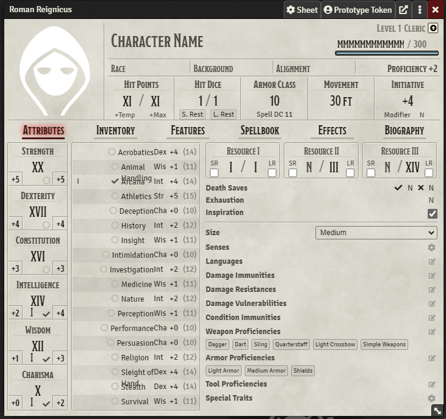
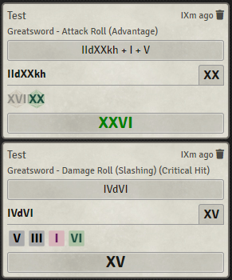

# FoundryVTT Roman Numerals

## What does it do?

Automatically converts a bunch of numbers in Foundry to roman numerals. Currently does anything in the chat log, and most stuff on character sheets.

## Why?

Someone joked about it and now they have to live with their mistakes.

## Todo

* Make it work on input elements (ability scores for example)
* Write tests or something like that

## Screenshots

